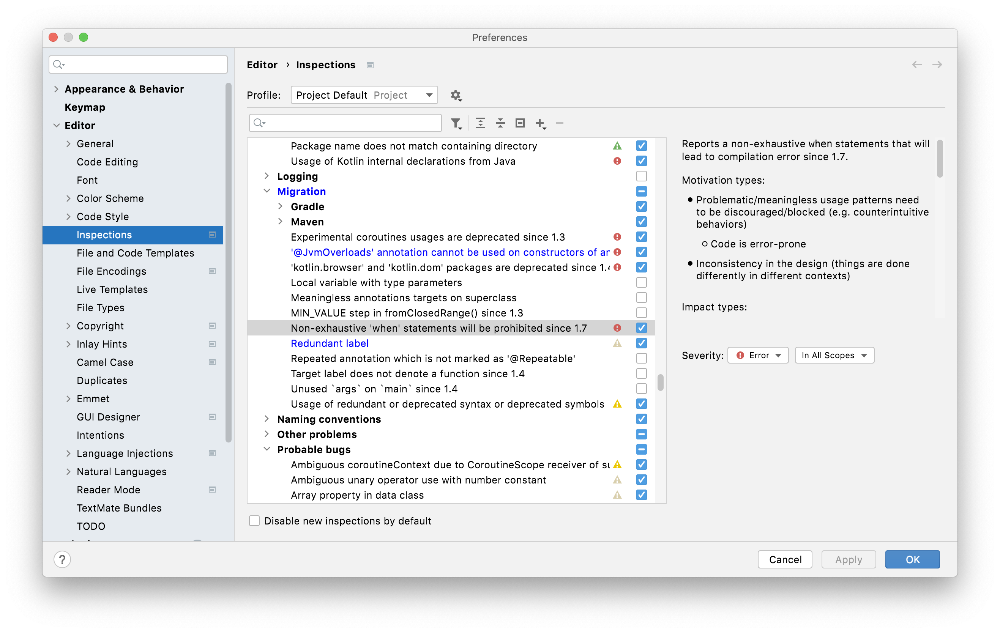

# {{page.title}}

In Kotlin 1.7, [Kotlin will check both `when` expressions and `when` statements for exhaustiveness in the same way][1]. As a result, we don't need the no-op `exhaustive` extension method we described in Chapter 18 of the
book.

In Kotlin versions up to and including 1.5, The compiler checks `when` expressions for exhaustiveness but does not
check when _statements_. The compiler considers when to be a statement if the value of the entire when expression
is unused. 

For example, if using `when` to handle elements of the following enum:

<!-- begin-insert: code-examples/src/main/dev/java_to_kotlin/sealed_when/SealedWhenExamples.kt#enum -->
```kotlin
enum class Direction {
    NORTH, EAST, SOUTH, WEST
}
```
<!-- end-insert -->

The compiler will not complain if you miss an element in a statement:

<!-- begin-insert: code-examples/src/main/dev/java_to_kotlin/sealed_when/SealedWhenExamples.kt#nonexhaustive -->
```kotlin
fun runInDirection(direction: Direction) {
    when (direction) {
        Direction.NORTH -> move(0, -1)
        Direction.EAST -> move(1, 0)
        Direction.WEST -> move(-1, 0)
        // no branch for Direction.SOUTH
    }
}
```
<!-- end-insert -->

As a result, you can force the compiler to check for exhaustiveness by using the result of the `when`, even if your code merely discards it. In the book, we showed how this can be done with a no-op extension method:

<!-- begin-insert: code-examples/src/main/dev/java_to_kotlin/sealed_when/SealedWhenExamples.kt#exhaustive_extension -->
```kotlin
val <T> T.exhaustive get() = this
```
<!-- end-insert -->

If you call `exhaustive` on the result of a when statement, the compiler considers the when to be an expression of type `Unit` and checks it for exhaustiveness.

<!-- begin-insert: code-examples/src/main/dev/java_to_kotlin/sealed_when/SealedWhenExamples.kt#force_exhaustive -->
```kotlin
fun walkInDirection(direction: Direction) {
    when (direction) {
        Direction.NORTH -> move(0, -1)
        Direction.EAST -> move(1, 0)
        Direction.WEST -> move(-1, 0)
        // no branch for Direction.SOUTH
    }.exhaustive
}
```
<!-- end-insert -->


In Kotlin 1.7 onwards a non-exhaustive when statement will be a compile-time error, and we will not need the `exhaustive` extension any more.  The "Inline property" refactoring will remove it entirely from the codebase.

Meanwhile, in Kotlin 1.6, non-exhaustive when statements will be reported as compile-time warnings.  The example above is reported with the warning:

> `Non exhaustive 'when' statements on enum will be prohibited in 1.7, add 'SOUTH' branch or 'else' branch instead`

To migrate to 1.7, we can configure IntelliJ to report non-exhaustive when statements as errors.



Compiling in [progressive mode][2] also reports non-exhaustive when statements as errors.

[1]: https://kotlinlang.org/docs/whatsnew1530.html#exhaustive-when-statements-for-sealed-and-boolean-subjects
[2]: https://kotlinlang.org/docs/whatsnew13.html#progressive-mode