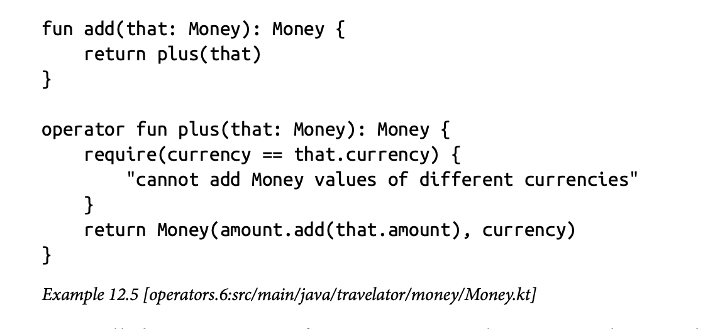

# Example Code



The examples refactoring sequences in the book are hosted in [a public GitHub repository](https://github.com/java-to-kotlin/code).

In the book, each step in a refactoring sequence has a reference immediately after the code, like this:

In electronic formats, the reference links to the version of the file on GitHub, and the change between that version of the code and the previous version.

If reading the book on paper,  you can turn the reference into links by entering the example number in the input box above.

In the Git repository, the different code examples evolve in separate branches. In this case, the branch is named "operators". Each step in the example is tagged. In this case, the  tag is named "operators.6".
The GitHub link is to code with that tag, so you can view that file and the others in the example at that version.

In the GitHub web app, you can also select other tags to see the different versions, compare tags to see how the code changes with each step, and switch between branches to see different examples.

For quicker navigation and easier comparison of tags, we recommend that you clone the repository to your local machine, open it in IntelliJ, and use IntelliJ's Git log panel to step through the history.

### Warning

The code examples are not real!
The codebase builds and passes its tests, but it is fictional.
There are places where the examples don't join up properly, and others where if you peek behind the curtain you will see us wiggling the levers.
We have tried to be honest, but prefer to ship!

## Using the Code Examples

This book is here to help you get your job done. 
In general, if example code is offered with this book, you may use it in your programs and documentation. 
You do not need to contact us for permission unless you’re reproducing a significant portion of the code. 
For example, writing a program that uses several chunks of code from this book does not require permission. 
Selling or distributing examples from O’Reilly books does require permission. 
Answering a question by citing this book and quoting example code does not require permission. 
Incorporating a significant amount of example code from this book into your product’s documentation does require permission.

We appreciate, but generally do not require, attribution. 
An attribution usually includes the title, author, publisher, and ISBN. For example: "_Java to Kotlin_ by Duncan McGregor and Nat Pryce (O’Reilly). Copyright 2021 Duncan McGregor and Nat Pryce, 978-1-492-08227-9."

If you feel your use of code examples falls outside fair use or the permission given above, please email  [permissions@oreilly.com](mailto:permissions@oreilly.com).
